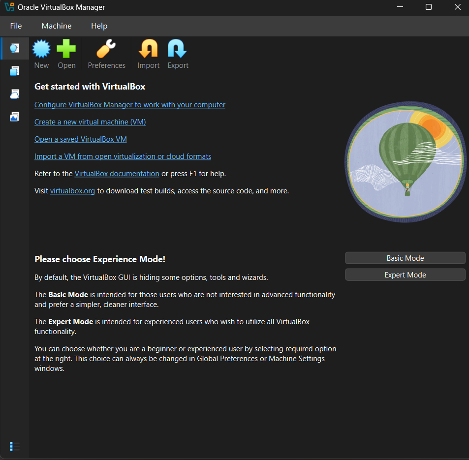
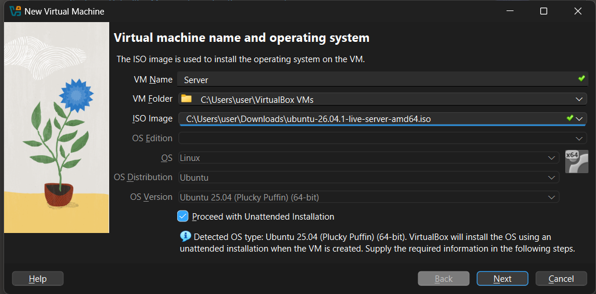
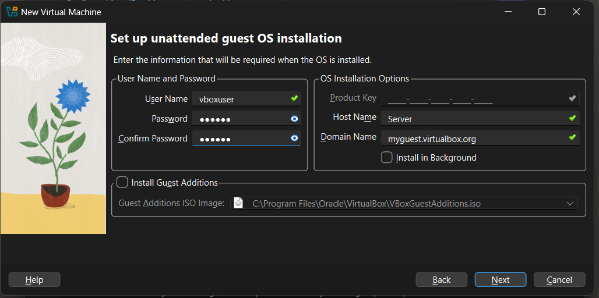
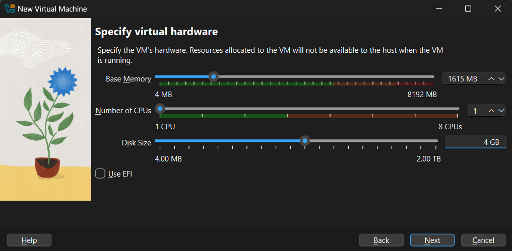
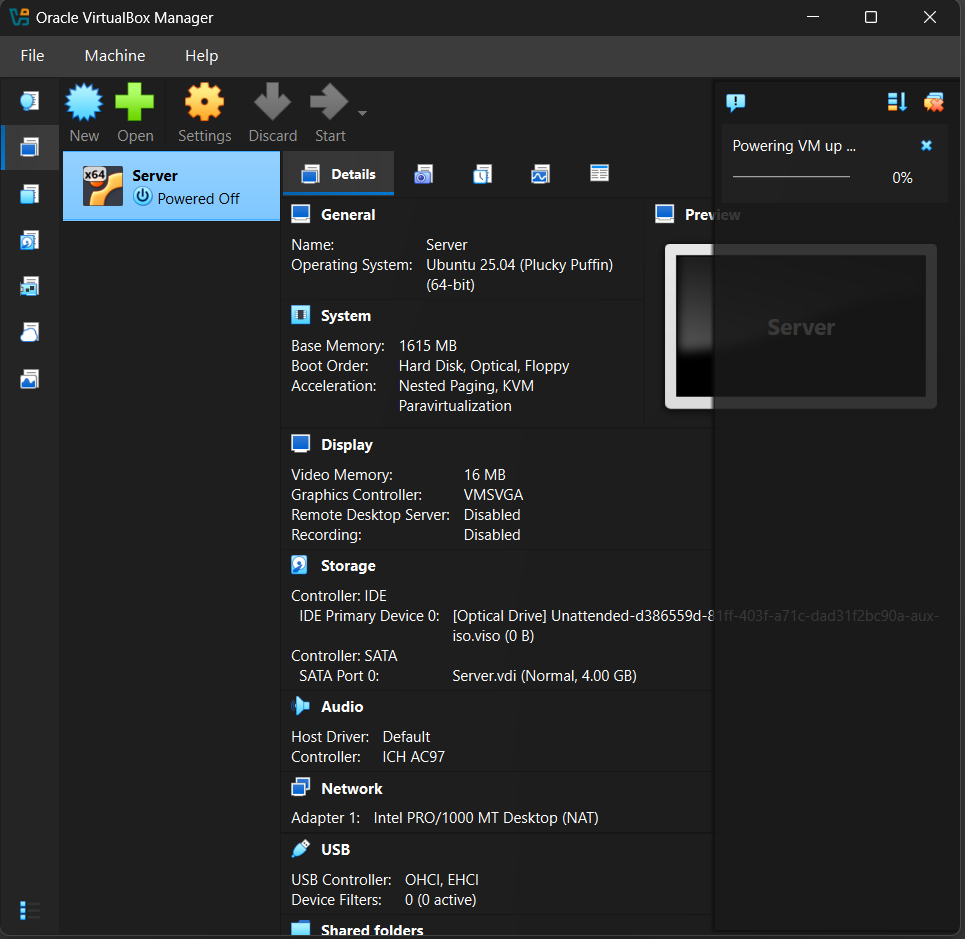
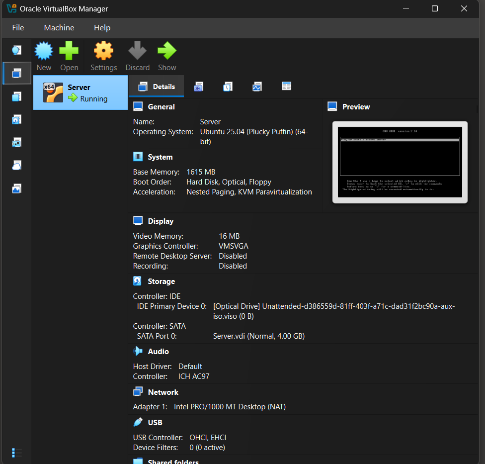

# Home Linux Lab

This repository includes steps on how I created and used virtual Ubuntu Linux server to have practise.

## Ubuntu server installation
Download and install Oracle VirtualBox and then download the latest Ubuntu server from the [official site](https://ubuntu.com/download/server)

Then, click install a new machine, choose Ubuntu server and set up username, password, memory size, number of CPUs and disk size

Now we have the server installed!

## Materials I used
- [Josh Madakor's YT channel](https://www.youtube.com/@JoshMadakor)